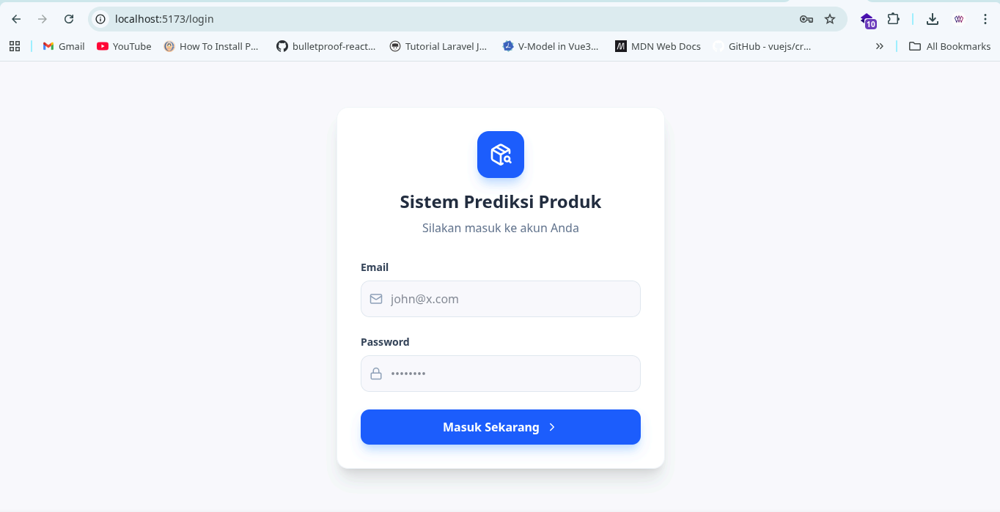
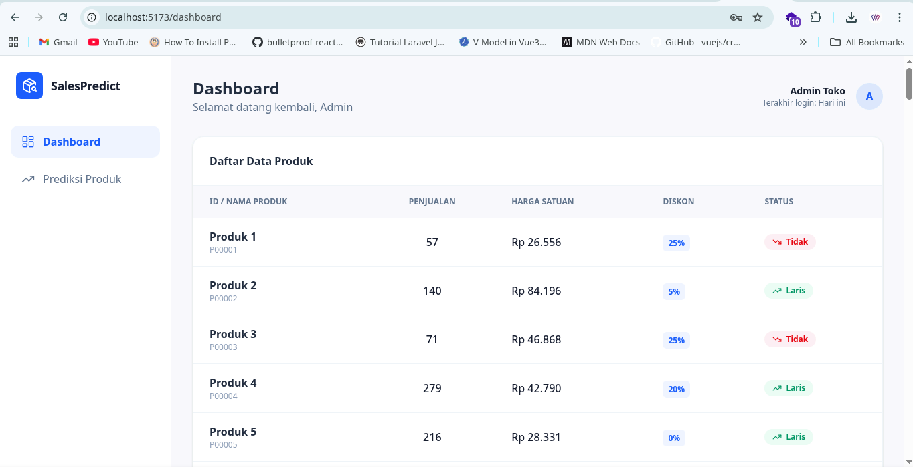
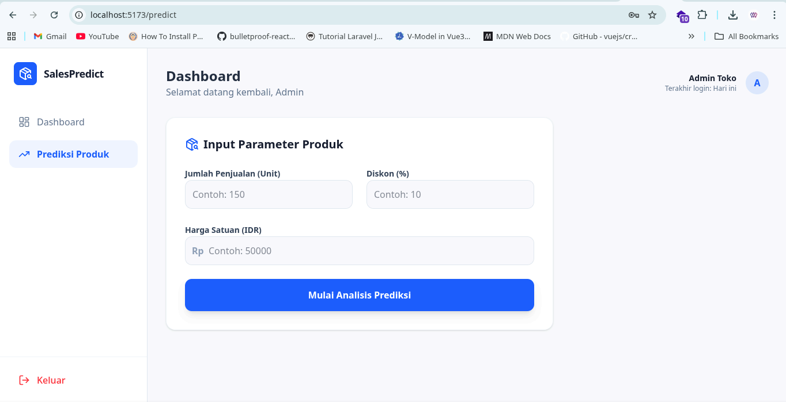
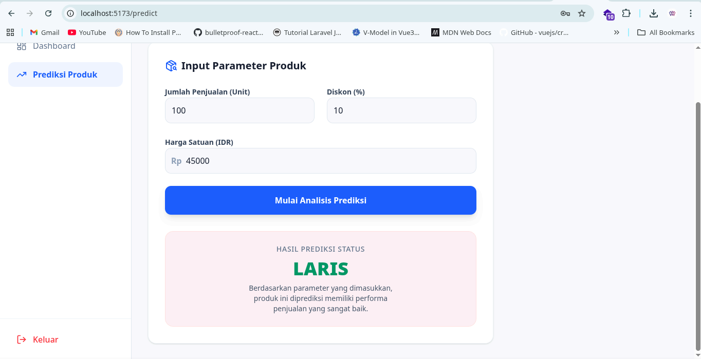

# Mini AI Sales Prediction System
Aplikasi sederhana untuk memprediksi status penjualan produk menggunakan Machine Learning, dengan arsitektur FastAPI (backend) dan React (frontend).

## Requirements
1. Python (Latest)
2. Nodejs (Latest)

## Cara Menjalankan Project
### 1. Clone Repository
```bash
git clone https://github.com/wahyuyudi2801/mini-ai-sales-prediction-system
cd mini-ai-sales-prediction-system
```
### 2. Backend (FastAPI)
Masuk ke folder backend:
```bash
cd backend
```
Buat virtual environment & install dependencies:
```
python -m venv venv
source venv/bin/activate  # (Linux/Mac)
venv\Scripts\activate     # (Windows)

pip install -r requirements.txt
```
Jalankan Server:
```
uvicorn main:app --reload
```
Backend akan berjalan di:
```
http://localhost:8080 
# or
http://localhost:8080/docs
```

3. Frontend (React.js)
Masuk ke folder frontend:
```
cd frontend
```
Install dependencies:
```
npm install
```
Jalankan aplikasi:
```
npm run dev
```
Frontend akan berjala di port:
```
http://localhost:5173
```
## API Endpoint
1. POST /login
 : Login menggunakan dummy user, menghasilkan JWT token
1. GET /sales : Mengambil data penjualan (butuh autentikasi)
2. POST /predict : Mengirim data produk untuk mendapatkan prediksi status (butuh autentikasi)

## Desain Decision
- FastAPI sebagai Backend
: Dipilih karena ringan, cepat, dan mudah untuk membuat REST API serta integrasi dengan model Machine Learning.
- React sebagai Frontend
: Digunakan untuk membangun UI interaktif dan memudahkan pemisahan antara frontend dan backend.
- JWT Authentication
: Digunakan untuk simulasi autentikasi tanpa kompleksitas database user.
- CSV sebagai Data Source
: Mempermudah setup tanpa perlu database, cocok untuk skala mini project.
- Model Machine Learning
: Model Logistic Regression digunakan untuk prediksi status produk.

## Asumsi yang digunakan
- User hanya dummy (hardcoded), tidak ada registrasi atau database user.
- Token JWT digunakan hanya untuk simulasi autentikasi, bukan production-ready security.
- Data penjualan berasal dari file CSV dan dianggap bersih atau minimal preprocessing.
- Model Machine Learning sudah dilatih sebelumnya atau menggunakan model sederhana.

## Screenshot UI
1. Login Page

2. Sales Data Page

1. Predict Page

1. Predict Result Page
